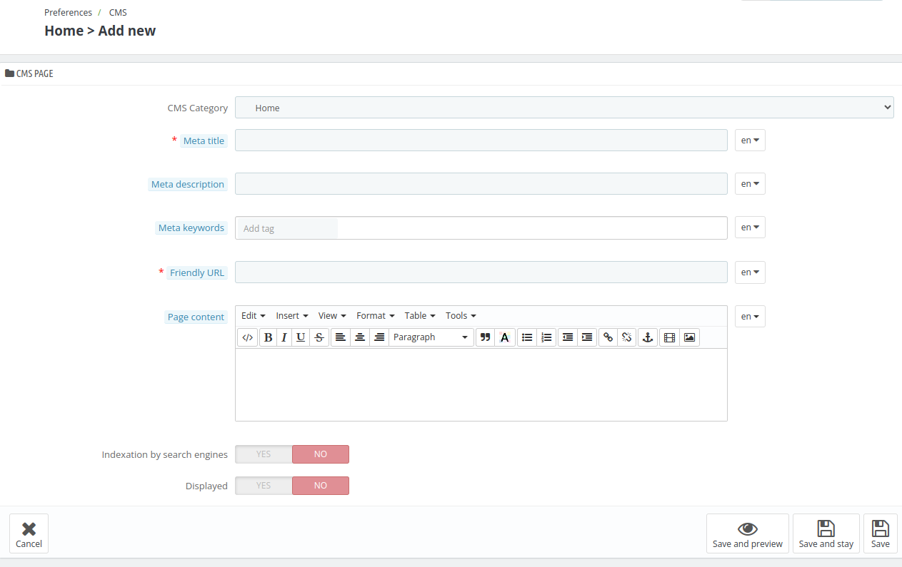

# CMS

The **CMS (Content Management System)** section allows hotel administrators to create, manage, and customize informational pages on their booking website. This feature helps in enhancing the guest experience by providing relevant details about the hotel, policies, services, and more.

---
CMS content is managed using two properties: Categories and Pages

- **Categories:** These allow you to centralize similar pages under a single section for better organization and navigation. By default, all pages are grouped under the "Home" category, but you can create new categories as needed to structure your content effectively.

- **Pages**: You can create new pages within the appropriate category or keep them under the default "Home" category, depending on your requirements.

## Add New CMS Category

To Add a new CMS category click on "Add new CMS Category" and fill in the following details:

- **Name**: Enter the title of the CMS category.
- **Displayed**: Choose whether to show or hide the category on the front-end.

- **Parent CMS Category:** Select the Parent CMS category.

- **Description**: Add a brief overview of the category for better understanding.

- **Meta Title**: Set a title for search engines to improve SEO visibility.

- **Meta Description**: Provide a short summary to describe the category for search engines.

- **Meta Keywords**: Add relevant keywords to enhance search engine rankings.

- **Friendly URL**: Customize the URL for better readability and SEO performance.

## Add New CMS Page

To Add a new CMS Page click on "Add new CMS page" and fill in the following details:

- **CMS Category**: Select the category under which the page will be listed (e.g., "Home").

- **Meta Title**: Set an SEO-friendly title that appears in search engine results.

- **Meta Description**: Provide a brief summary of the page content to improve search rankings.

- **Meta Keywords**: Add relevant keywords to help search engines understand the page content.

- **Add Tag**: Include tags to categorize and organize content for better accessibility.

- **Friendly URL:** Create a custom, easy-to-read URL to enhance SEO and user experience.

- **Page Content**: Add and format text, images, and links to design your page.

- **Indexation by Search Engines**: Choose whether search engines should index the page for better online visibility.

- **Displayed**: Select whether to make the page visible to visitors on the website.

