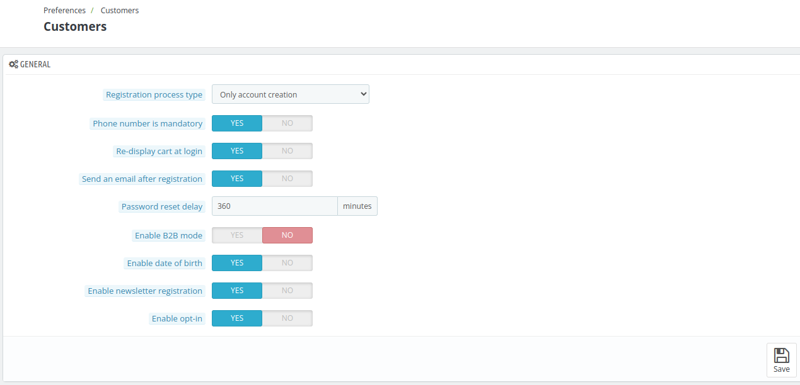

# Customers

The **Customer Section** allows the admin to configure customer-related settings, including selecting the registration process type, making the phone number mandatory, enabling cart re-display upon login, sending a confirmation email after registration, setting Number of orders to use to calculate frequent customers and much more.

## General

- **Registration Process Type**: Select the type of registration process, such as account creation only and account creation with address.

- **Phone Number is Mandatory**: Choose if  customers Require to provide their phone number during registration or not.

- **Re-Display Cart at Login**: Enable to show the customer's previous cart when they log in.

- **Send an Email After Registration**:Click on yes if you want to send a  confirmation email Automatically to customers after registration.

- **Password Reset Delay**: Set a Minimum time required between 2 requests for a password reset.

- **Enable B2B Mode**: Activate features designed for business-to-business transactions.

- **Enable Date of Birth**: Allow the collection of customers' date of birth during registration.

- **Enable Newsletter Registration**: Provide an option for customers to sign up for newsletters.

- **Enable Opt-In**: Include an opt-in checkbox for marketing or consent purposes.

## Customer KPI configuration

- **Number of Orders to Use to Calculate Frequent Customers**: Set the minimum number of orders required to consider a customer frequent.

- **Number of Days to Use to Calculate RevPAC**: Define the number of days to calculate Revenue per Available Customer (RevPAC).

- **Number of Days to Use to Calculate Conversion Rate**: Set the number of days to calculate the conversion rate.

- **Number of Days for Which a Customer is Considered 'New'**: Specify the number of days a customer is considered "new" after registration.

