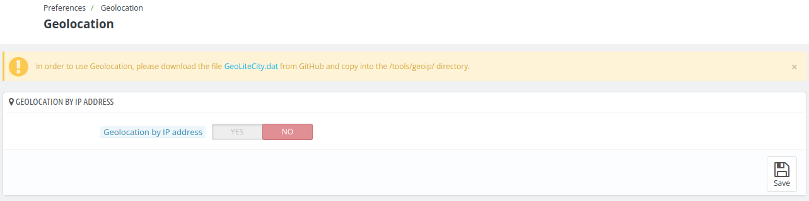
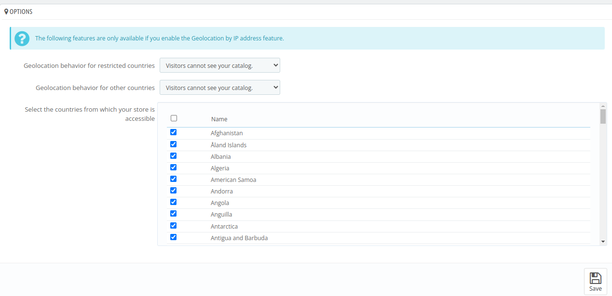
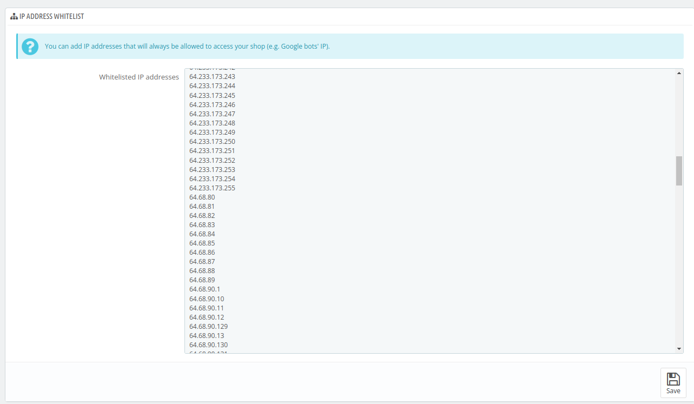

# Geolocation

The **Geolocation feature** enables hotel administrators to restrict and customize user access based on their geographic location, enhancing overall security.

*Note- In order to use Geolocation, please download the file GeoLiteCity.dat from GitHub and copy into the `/tools/geoip/` directory.*

## Geolocation by IP address

- **Geolocation by IP address**: If enabled, this option  allows admin to restrict his hotel access for certain countries.

## Options

*Note- The following features are only available if you enable the Geolocation by IP address feature.*

- **Geolocation behavior for restricted countries**: Choose from the available options in the dropdown menu:

1. **Visitors cannot see your catalog :** If selected, visitors from restricted countries won't be able to view any rooms.

2. **Visitors can see your catalog but cannot place an order**: With this option, visitors from restricted countries can browse the website, view rooms, but cannot place an order.

- **Geolocation behavior for other countries**: Choose from the available options in the dropdown menu:

1. **All features are available**: if selected, visitors will be able see the rooms and can place the order too.

2.  **Visitors cannot see your catalog :** If selected, visitors from restricted countries won't be able to view any rooms.

3. **Visitors can see your catalog but cannot place an order**: With this option, visitors from restricted countries can browse the website, view rooms, but cannot place an order.

- **Select the countries from which your store is accessible**: Select from the list where you want your hotel to be accessible.

## IP address whitelist

*Note- You can add IP addresses that will always be allowed to access your hotel (e.g. Google bots' IP).*

- **Whitelisted IP addresses**: Enter your whitelisted IP addresses.
