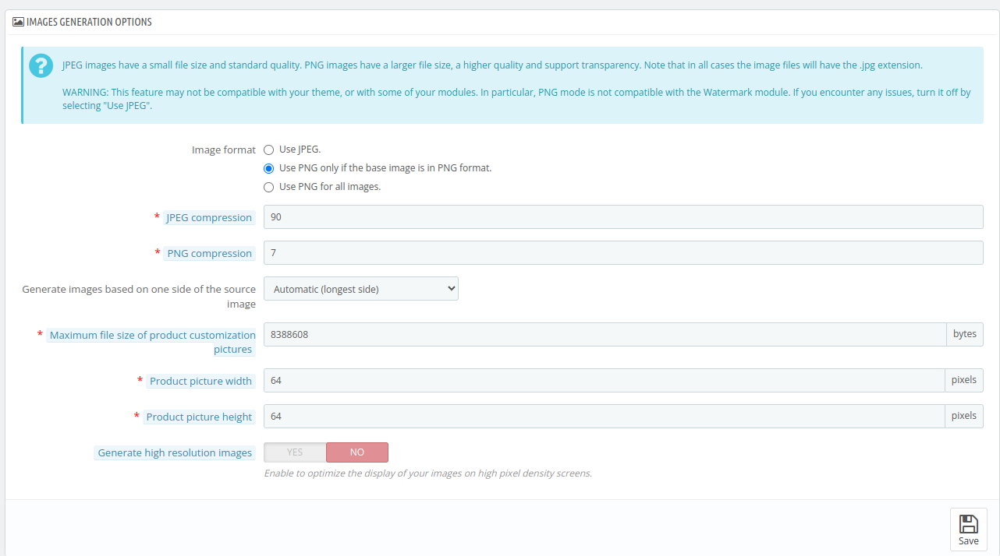

# Images

The **Images Section** in QloApps is designed to optimize your website's performance by automatically processing uploaded images. When you upload an image, QloApps intelligently breaks it down into multiple resolutions based on the predefined settings. This ensures that the right image size is displayed across different devices, providing a faster and more seamless experience for your visitors

The admin can also toggle the visibility of images for Room Types, Products, Categories, and Hotels, enabling or disabling them as needed for better organization and display management.

## Add new Image type

To add a new image click on "Add new image type" and fill in the following details:

- **Image Type Name**: Assign a specific name to each image type for identification.

- **Width & Height**: Enter the dimensions of the images in pixels to ensure consistent sizing.

- **Room Types/Products**: Enable or disable image for room types and products as needed.

- **Categories**: Toggle the display of image for categories on the website.

- **Hotels**: Control the visibility of image for hotel listings.

## Images generation options

JPEG images have a small file size and standard quality. PNG images have a larger file size, a higher quality and support transparency. Note that in all cases the image files will have the .jpg extension.

*WARNING: This feature may not be compatible with your theme, or with some of your modules. In particular, PNG mode is not compatible with the Watermark module. If you encounter any issues, turn it off by selecting "Use JPEG".*

- **Image Format**: Choose the format for images—JPEG for general use, PNG for images with a transparent base, or PNG for all images.

- **JPEG Compression**: Adjust the compression level for JPEG images to balance quality and file size (default: 90).

- **PNG Compression**: Set the compression level for PNG images (default: 7).

- **Generate images based on one side of the source image**: choose from dropdown menu to generate image.

- **Max File Size for Customization Images**: Define the maximum size (in bytes) for product customization images.

- **Product Image Dimensions**: Set the width and height for product pictures, a customer can upload.

- **High-Resolution Images**: Enable the generation of high-resolution images for enhanced clarity.

## Regenerate thumbnails

The **Regenerate Thumbnails** feature is useful when you make changes to image settings, such as updating image dimensions or switching to a new theme. It allows you to recreate all thumbnails based on the latest configurations, ensuring that images are displayed correctly across the website

- **Select an Image**: Choose the specific image(s) to regenerate from dropdown menu.

- **Erase Previous Images**: Decide whether to delete previously generated images (Yes) or keep them (No). Select "No" if your server timed out and you need to resume image regeneration.

*Note*
- *Regenerates thumbnails for all existing images.*
- *Please be patient. This can take several minutes.*

- *Be careful! Manually uploaded thumbnails will be erased and replaced by automatically generated thumbnails.*

