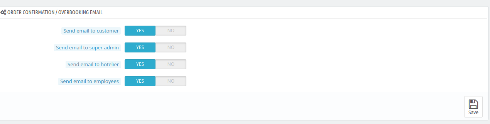

# Orders

The **Orders Section** allows the admin to configure various order-related settings, such as enabling guest checkout without registration, setting the maximum global checkout date for room bookings, specifying recipients for order confirmations or overbooking emails, and much more.

## Order Restrict

Under this section, admin can configure the following options:

- **Maximum Global Check-out Date to book a room**: Set a Maximum date of Check-out for room bookings.

- **Minimum booking offset**: Sets the minimum number of days before the check-in date that a guest must book the room, Set to "0" to disable this feature.

- **Allow backdate order from Back-office for super-admin**: Click on yes if you want super-admin to create a booking from back date.

- **Allow backdate order from Back-office for employees**: Click on yes if you want employees to create a booking from back date.

## General

This section allows the admin to:

- **Enable guest checkout**: Click on yes if you want visitors to checkout without registering on your website.

- **Minimum purchase total required in order to validate the order**: Set the minimum amount to
place an order.( Set to 0 to disable this feature).

- **Terms of service**: Click on yes if you want your customers to accept the terms of service before processing an order.

- **CMS page for Terms and Conditions**: Select the CMS page from the dropdown menu which contains your website's Terms & Conditions.

- **Show room price breakdown**: Click on yes if you want to show room price breakdown for rooms with auto-added services.

*Note- This room price breakdown will always be shown if cart rule for specific room type is applied on that room*.

- **Display order list prices in**: Choose the currency in which you want the prices to be displayed in the order list.

- **Days for Average Order Value KPI**: Set the number of days used to calculate the Average Order Value in the KPIs.

- **Days for Net Profit Per Visitor KPI**: Set the number of days used to calculate the net profit per visitor in the KPIs.

## Order Confirmation / Overbooking Email

The **Order Confirmation / Overbooking Email** settings allow the admin to configure email notifications for specific recipients such as:

- **Send email to customer**: Click on yes if you want to send order confirmation or overbooking email to customers.
- **Send email to super admin**: Click on yes if you want to send order confirmation or overbooking email to the super admin.
- **Send email to hotelier**: Click on yes if you want to send order confirmation or overbooking email to the hoteliers. Mail will be sent to the email saved while creating the hotel.

- **Send email to employees**: Click on yes if you want to send order confirmation or overbooking email to employees having permission to manage the hotel.

## OverBooking

The **Overbooking section** allows the admin to configure actions for overbooked orders, such as:

- **Overbookin order action**: If admin choose to select "Take the overbooking" then he'll see a new option
- **Maximun hotel overbookings per date**: Here, he have to enter the max number of overbooking that can be created for any date.

*When maximun number of the overbookings on any date in the booking duration is reached, then the new overbooking order will be cancelled.(Set 0 for no limit).*

- **Resolve overbooking automatically**: Click on yes if you want to resolve overbooking automatically.

    If enabled, the overbookings in the order will be resolved automatically when rooms are available to be replaced with all overbooked rooms in the order.