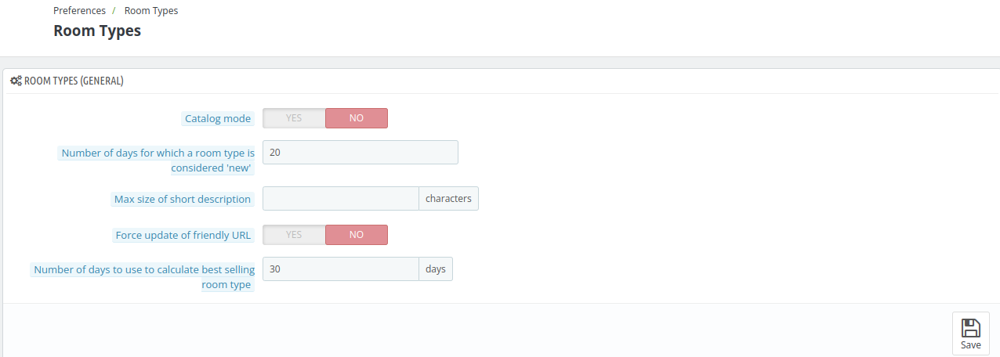

# Room Types

The **Room Types** page allows the admin to configure various settings, including enabling or disabling Catalog Mode and setting how long a room type is considered "new."

Admin can also choose between Occupancy-wise search or search without occupancy for front-end filtering, with occupancy search restrictions based on this choice.

Additionally, it offers options to display services by category, set the number of hotel images per page, and customize various other settings to optimize room listings and enhance the user experience.

## Room types(General)

- **Catalog Mode**: Enable this option if you want visitors to browse and view your rooms on the website, but restrict them from placing an order.

- **Number of Days for New Room Type**: Set the number of days (e.g., 20) for which a room type is considered "new."

- **Max Size of Short Description**: Limit the number of characters for the short description of a room type(in characters).

- **Force Update of Friendly URL**: Enable or disable the automatic update of the room's friendly URL.

- **Number of Days to Calculate Best Selling Room Type**: Define the number of days used to calculate the best-selling room type based on bookings.

## Search

- **Front End Search Type**:  Choose between "Occupancy-wise search" or "Search without occupancy".  occupancy input field on search will be based on this option selection at the front-end.

1. If you choose "Occupancy-wise search" then,

    -    **Front End Occupancy-wise Search Algorithm**: In occupancy wise search for the Front office choose if you want to display room types that are fully satisfying searched occupancy or all the available rooms types.

2. If you choose "Search without occupancy" then,

   - **In front-end, add rooms to cart with**: with the 'room occupancy option', while adding room in cart the customer has to select per room occupancy and with  the 'room quantity' option, the customer only has to select the number of rooms.

- **Back Office Search Type**: Choose between "Occupancy-wise search" or "Search without occupancy". occupancy input field on book now search will be based on this option selection at the Back-end.

1. If you choose "Occupancy-wise search" then,

   - **Back Office Occupancy-wise Search Algorithm**: In occupancy wise search for the back office Choose if you want to display room types that are fully satisfying searched occupancy or all the available rooms types.

2. If you choose "Search without occupancy" then,

   - **In back-end, add rooms to cart with**: with the 'room occupancy option', while adding room in cart the customer has to select per room occupancy and with  the 'room quantity' option, the customer only has to select the number of rooms

   

- **Apply Min and Max Length of Stay Restrictions for Back-Office Search**: Enable or disable minimum and maximum length-of-stay restrictions for back-office searches.

- **Display Remaining Number of Rooms when rooms are lower than or equal to**: Mention the minimum quantity of room after which an alert message of rem rooms will get displayed to the users.

## Room type page

- **Enable JqZoom Instead of Fancybox on room type page**: Choose whether to use JqZoom instead of Fancybox for image zoom functionality on the room type page.

- **Display Discounted Price**: Enable to show the new price with the applied discount in the volume discounts board, instead of displaying the discount percentage (e.g., "-5%").

- **Display Services by Category**: Decide whether to organize and display Room Type services by category or not.

- **Number of Hotel Images per Page**: Set the maximum number of hotel images displayed on a single page.

