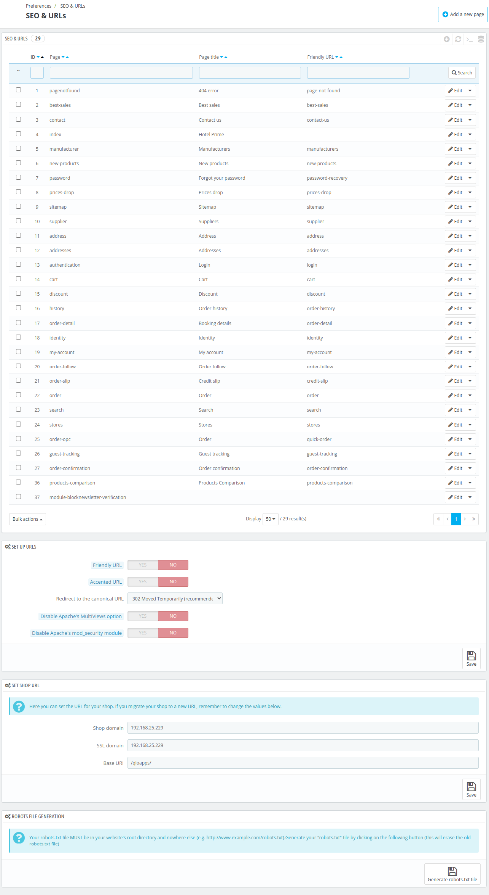
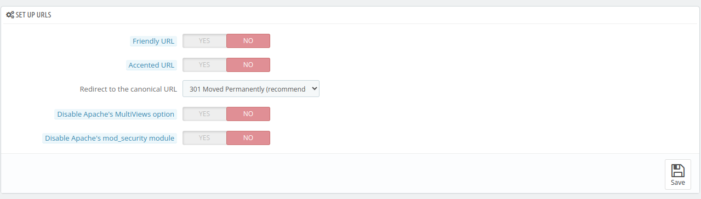
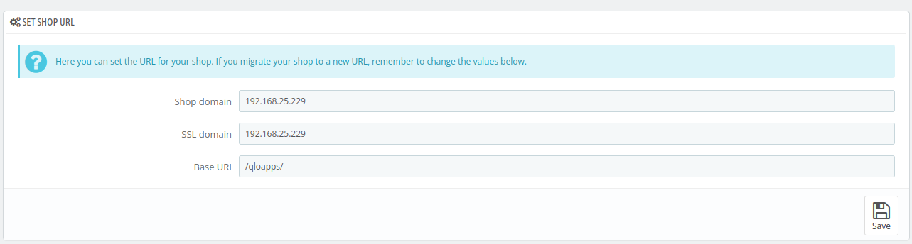
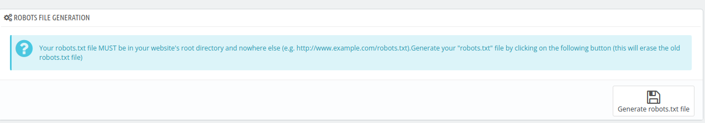

# SEO & URLs

The **SEO and URLs Section** allows the admin to optimize the website for search engines by configuring meta titles, descriptions, and keywords.

The admin can view all SEO settings and URL structures along with their respective page names and friendly URLs.

Admins have the ability to customize the URL structures and enable friendly URLs.

## Add  new page

To add a new page click on "Add new page" and fill in the following details:

- **Page**:Choose the name of the related page from dropdown.

- **Page title**: Enter the title for the page.

- **Meta description**: write a short description.

- **Meta keywords**: Enter the list of keywords for the search engine.

- **Rewritten URL**" Enter the rewritten URL.

## Set up URLs

Here, the admin can configure the following:

- **Friendly URL**: Enable or disable friendly URLs(if your server allows URL rewriting).

- **Accented URL**: Allow or disallow accented characters in URLs.

- **Redirect to the Canonical URL**: Set up a redirection to the canonical URL from the dropdown. "302 Moved Temporarily" is recommended during store setup.

- **Disable Apache's MultiViews Option**: Enable this option of you have problems with rewriting URL.

- **Disable Apache's mod_security Module**: Disable this module if some features of QloApps aren't functioning properly, as it might block certain features.

## Set shop URL

Here you can set the URL for your shop. If you migrate your shop to a new URL, remember to change the values below.

- Shop domain

- SSL domain

- Base URI

## Robots file generation

Your robots.txt file MUST be in your website's root directory and nowhere else (e.g. http://www.example.com/robots.txt).

Generate your "robots.txt" file by clicking on the following button (this will erase the old robots.txt file)
