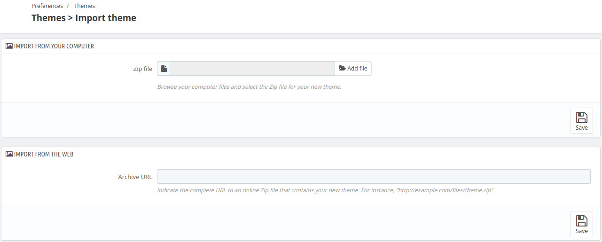
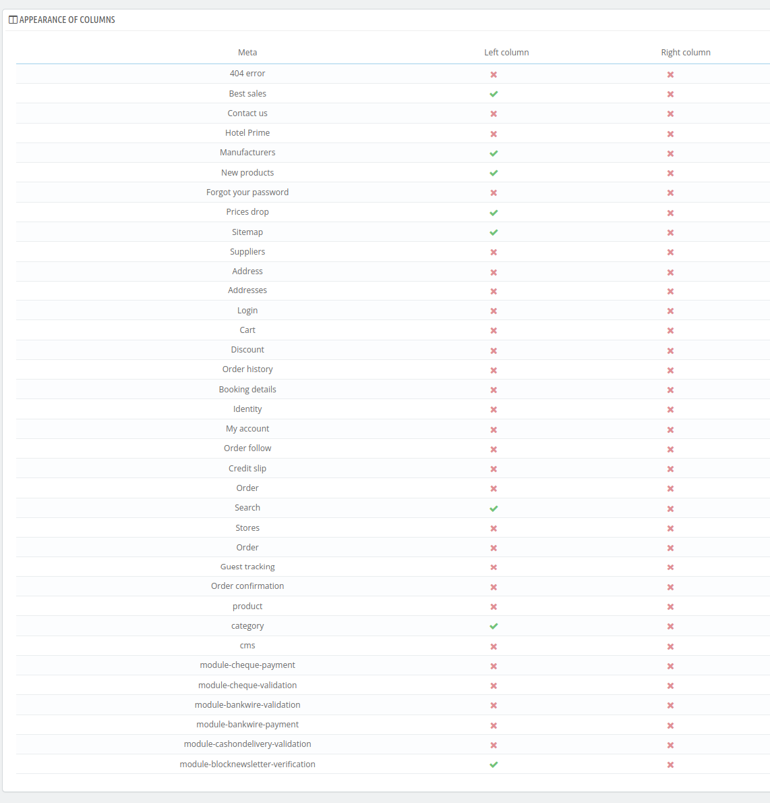

# Themes

The **Themes Section** allows the admin to customize the appearance of the website by selecting, managing, and configuring different themes.

Admin can upload new themes, modify existing ones, enable or disable theme options, and adjust the layout, and typography to create a personalized look and feel for the website.

## Add new theme

To add a new theme click on "Add new theme" then you'll see the following options.

### Import from your computer

Choose this option and Browse your computer files and select the Zip file for your new theme.

### Import from the web

Indicate the complete URL to an online Zip file that contains your new theme if you want to import it from the web.

### Import from FTP

Select the archive from the dropdown menu

This selector lists the Zip files that you uploaded in the 'themes' folder.

### Create a new theme

with this option, the admin can Duplicate an existing theme and edit it; or create a new theme from scratch!

*Note-Recommended for advanced users only.*

To create a new theme click on "Create new theme" and you'll be redirected to the following page asked to fill these fields:

#### Theme

- **Name of the Theme**: Set the name of the theme used for the website.

- **Preview Image for the Theme**: Upload a preview image to represent the theme visually.

- **Default Left Column**: Choose a default behavior when displaying the column in a new page added by you or by a module.

- **Default Right Column**: Choose a default behavior when displaying the column in a new page added by you or by a module.

- **Number of Products Per Page**: Set the number of products displayed per page in the theme.

- **Name of the Theme's Directory**: Specify  the directory name for the theme files.

- **Copy Missing Files from Existing Theme**: select the theme from dropdown to ensure all required files are present by copying them from an existing theme.

- **Responsive**: Ensure the theme is responsive, adapting to different screen sizes and devices.

## Export a theme

To export a new theme click on "export new theme" and you'll be redirected to the following page asked to choose the theme from the dropdown menu.

## Your current theme

This section Displays the active theme, such as "hotel-reservation-theme" with its version (e.g., version 1.0), designed by QloApps.

Here, admin can Configure theme's advanced settings, such as the number of columns he want for each page.

*Note- This setting is mostly for advanced users.*

Admin can also change the header logo for both the website and mobile, configuring invoices & email logos, uploading a favicon for browser tabs, and adjusting the map icon for location-based pages.

## Advanced settings

When the admin clicks on advanced settings, he'll be redirected to a page where he's asked to edit the following fields:

### Theme

Under this section, the admin will be asked to edit the same fields just like he did when [adding a new theme](Themes-Add-new.png).

### Appearance of columns

With this section, the admin can manage the layout and arrangement of the left and right columns on the website.

