# Stats
In this tab you can see various stats and analysis of your QloApps like Best customer, Best Hotels etc.

There are various Stats which you can see in this tab:

### Filters
You can apply various date filters to customize your data view. Options include filtering by day, month, or year. Additionally, you can specify a custom date range to filter the data accordingly.

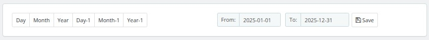

## Best Customers
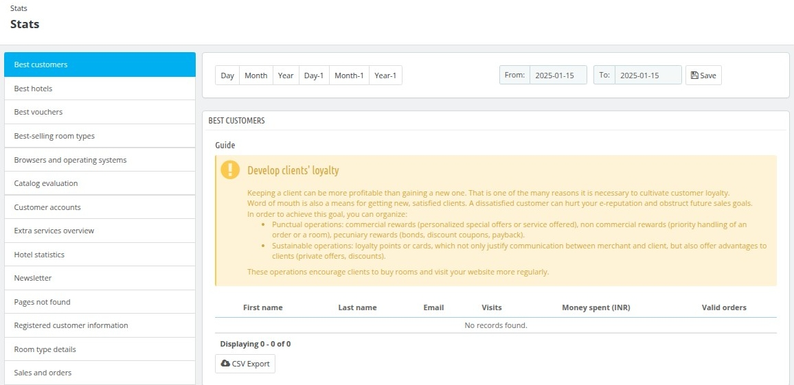

In this section, you can access a comprehensive list of your top customers within a specified date range. This list provides valuable insights into your most engaged and high-value clients. The top customers are determined based on three primary criteria:  

1. **Number of Website Visits**: The frequency with which a customer visits your website, reflecting their engagement and interest in your offerings.  
2. **Total Money Spent**: The cumulative amount spent by the customer during the specified period, showcasing their contribution to your revenue.  
3. **Number of Valid Orders**: The total count of confirmed and successful orders placed by the customer, indicating their purchasing behavior and loyalty.  

Key features include:

- Export Options: The results can be conveniently downloaded in CSV file format for further analysis.

## Best Hotels

In this section, you can access a detailed list of your top-performing hotels within a specified date range. This list provides key metrics to help you evaluate the performance and profitability of each hotel. The top hotels are assessed based on the following criteria:  

1. **Room Nights Booked**: The total number of room nights reserved, reflecting the demand and occupancy for the hotel.  
2. **Available Rooms**: The number of rooms available during the specified period, providing insights into inventory management and utilization.  
3. **Orders**: The total count of confirmed bookings or reservations, indicating the hotel's booking activity.  
4. **Revenue**: The total earnings generated by the hotel, showcasing its contribution to overall business income.  
5. **Margin**: The profit margin achieved, highlighting the financial efficiency and profitability of the hotel.  
6. **Average Revenue**: The average revenue generated per booking or room night, offering a clear picture of the hotel's financial performance.  

Key features include:

- Export Options: The results can be conveniently downloaded in CSV file format for further analysis.

## Best Vouchers

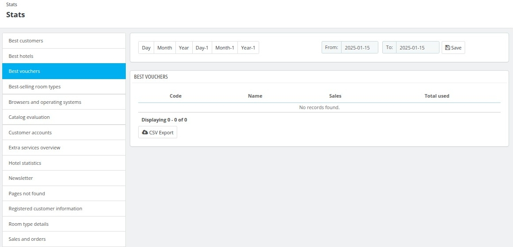

In this section, you can view a list of your top Vouchers used by the customers within a specified date range.

Key features include:

- Export Options: The results can be conveniently downloaded in CSV file format for further analysis.

## Best-selling room type

In this section, you can access a comprehensive list of your best-selling room types within a specified date range. This list highlights key performance metrics that provide valuable insights into the popularity and profitability of different room categories. The best-selling room types are evaluated based on the following factors:  

1. **Room Nights Booked**: The total number of room nights reserved for each room type, reflecting customer demand.  
2. **Price Sold**: The price at which the room was booked, indicating the revenue potential and pricing strategy effectiveness.  
3. **Revenue**: The total income generated from bookings of the room type, showcasing its contribution to overall earnings.  
4. **Bookings per Day**: The average number of bookings made per day for the room type, offering insights into its popularity over time.  
5. **Room Nights Available**: The total number of room nights available for the room type, highlighting its inventory and utilization rate.  

Key features include:

- Export Options: The results can be conveniently downloaded in CSV file format for further analysis.

## Browser and Operating System

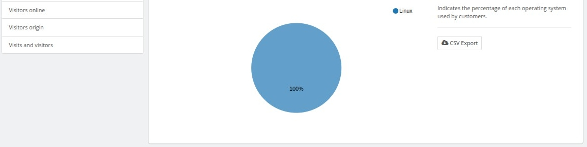

In this section, you can monitor the web browsers and operating systems that your customers use to access your website. This information provides valuable insights into user preferences and technological trends. The data includes the following details:  

1. **Percentage of Web Browsers Used**: The proportion of customers using each web browser, helping you understand which browsers are most popular among your audience.  
2. **Percentage of Operating Systems Used**: The proportion of customers using each operating system, offering insights into the platforms your audience relies on.  

Tracking this data is essential when making updates or introducing changes to your website. It ensures that any new features or functionalities are compatible with the software most widely used by your customers, avoiding issues that may limit access for certain users. This analysis supports better decision-making to optimize the user experience across all platforms.

Key features include:

- Export Options: The results can be conveniently downloaded in CSV file format for further analysis.

## Catalog Evaluation

In this section you can see the stats of different room types and services based on the criteria set 
by you like for the length of Description , size of images,
orders, total rooms.

It will show the results based on the criteria:
- If room type is satisfying the condition of Alright it will show in green.
- If room type if satisfying condition of not enough it will show in red.
- If room type is between Alright and Not enough it will show in Orange.

## Customer Accounts

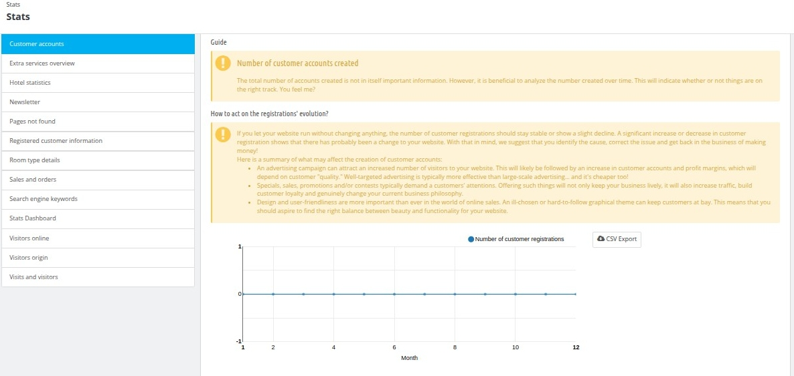

In this section, you can monitor the number of customers who have registered on your website during a specific period. The information is displayed in a graph that shows how registrations have changed over time.

The graph provides a straightforward view of the data, with one axis representing the number of customer registrations and the other showing the corresponding months. This allows you to observe trends in customer sign-ups and understand how they vary over the selected time frame.

Key features include:

- Export Options: The results can be conveniently downloaded in CSV file format for further analysis.

## Extra Services Overview

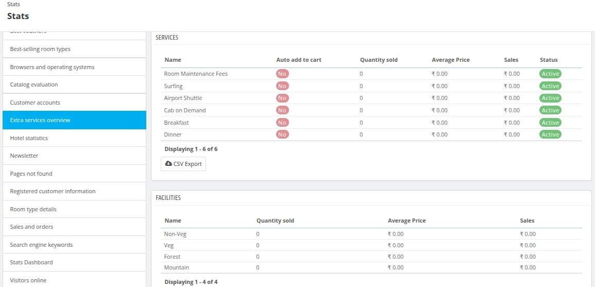

In this section, you can monitor the extra services and facilities offered by the hotel, along with their associated details.  

#### **Services Section**  
- **Name**: Displays the name of each service offered, such as "Room Maintenance Fees," "Surfing," "Airport Shuttle," and more.  
- **Auto Add to Cart**: Indicates whether the service is automatically added to the cart (Yes/No).  
- **Quantity Sold**: Shows the number of times the service has been purchased by customers.  
- **Average Price**: Displays the average price of the service sold.  
- **Sales**: Shows the total revenue generated from the service.  
- **Status**: Indicates whether the service is currently active or inactive.  

#### **Facilities Section**  
- **Name**: Displays the name of each facility, such as "Non-Veg," "Veg," "Forest," and "Mountain."  
- **Quantity Sold**: Shows the number of times the facility has been utilized or purchased.  
- **Average Price**: Displays the average price of the facility sold.  
- **Sales**: Shows the total revenue generated from the facility.  

Key features include:

- Export Options: The results can be conveniently downloaded in CSV file format for further analysis.

## Hotel Statistics

### Hotel Statistics Overview  

This section provides a detailed analysis of the statistics related to your hotel. You can filter the data by selecting a specific hotel from the dropdown menu or view combined statistics for all hotels. The metrics displayed help you evaluate the performance of your hotel operations.  

#### Key Metrics:  
1. **Available Room Types**: Displays the number of different room types currently available for booking.  
2. **Average Base Price**: Shows the average base price of the available room types.  
3. **Hotel Page Views**: Indicates the total number of views for the hotel’s main page.  
4. **Room Type Page Views**: Reflects the total number of views for individual room type pages.  
5. **Booked Room Nights**: Represents the total number of room nights booked during the selected period.  
6. **Average Number of Page Visits**: Provides the average number of times the hotel’s pages were visited.  
7. **Average Number of Bookings**: Shows the average number of bookings made within the specified period.  
8. **Available Images**: Indicates the total number of images uploaded for the hotel and its rooms.  
9. **Room Types Never Viewed**: Displays the number of room types that have not been viewed by customers.  
10. **Room Types Never Purchased**: Indicates the number of room types that have not been booked.  
11. **Conversion Rate**: Defines the average conversion rate for the room type pages. It is calculated based on the number of purchases compared to the number of visits.  

This section is designed to provide actionable insights into your hotel’s performance, helping you identify areas for improvement and optimize your offerings to meet customer demands effectively.

## Newsletter

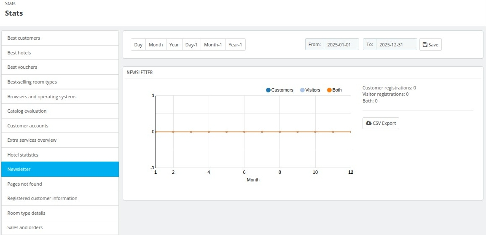

### Newsletter Statistics  

This section provides detailed insights into the performance of your newsletter campaign. It enables you to track customer and visitor registrations linked to your newsletter over a specified time range.  

#### Key Features:  
1. **Filter by Time Period**:  
   You can adjust the time range using the provided options (Day, Month, Year, Day-1, Month-1, Year-1) or by selecting specific start and end dates in the "From" and "To" fields.  

2. **Graphical Representation**:  
   The graph visually represents the number of registrations linked to the newsletter for the chosen time frame. It categorizes data into:  
   - **Customers**: Registered users who subscribed to the newsletter.  
   - **Visitors**: Non-registered users who subscribed.  
   - **Both**: A combined count of customers and visitors.  

3. **Summary Details**:  
   - **Customer Registrations**: Displays the total number of registered users who subscribed.  
   - **Visitor Registrations**: Shows the count of non-registered users who subscribed.  
   - **Both**: The combined total of customer and visitor subscriptions.  

4. **Export Option**:  
   You can export the data in CSV format for further analysis or record-keeping purposes.  

This section helps you monitor the effectiveness of your newsletter campaigns, understand audience engagement, and make data-driven decisions to optimize your marketing strategies.

## Page Not found

This section displays the number of times your website encountered a "Page Not Found" error. This error typically occurs when a customer enters an incorrect or non-existent link.

## Registered Customer Information

### Registered Customer Information  

This section provides an overview of the demographics of your registered customers, presented through a pie chart for easy visualization and analysis.  

#### Key Attributes:  
1. **Gender**:  
   The pie chart categorizes customer data based on gender distribution, allowing you to see the percentage of male, female, or other identified genders among your registered users.  

2. **Age**:  
   Customer data is grouped by age ranges, providing insights into the age demographics of your customer base. This helps in tailoring marketing strategies to specific age groups.  

3. **Country**:  
   The pie chart shows the geographic distribution of registered customers based on their country. This information helps identify where your customers are located, aiding in localized marketing efforts.  

Key features include:

- Export Options: The results can be conveniently downloaded in CSV file format for further analysis.

## Room type details

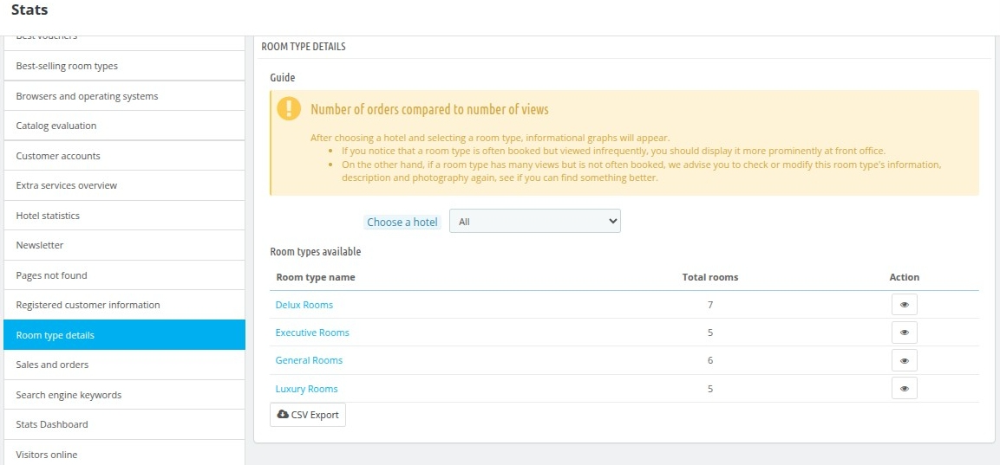

This section provides insights into the relationship between the number of orders and the number of views for your room types. After selecting a hotel and room type, informational graphs will display relevant statistics.

Click on Action button to insights of  a room.

Key features include:

- Export Options: The results can be conveniently downloaded in CSV file format for further analysis.

## Sales and Orders

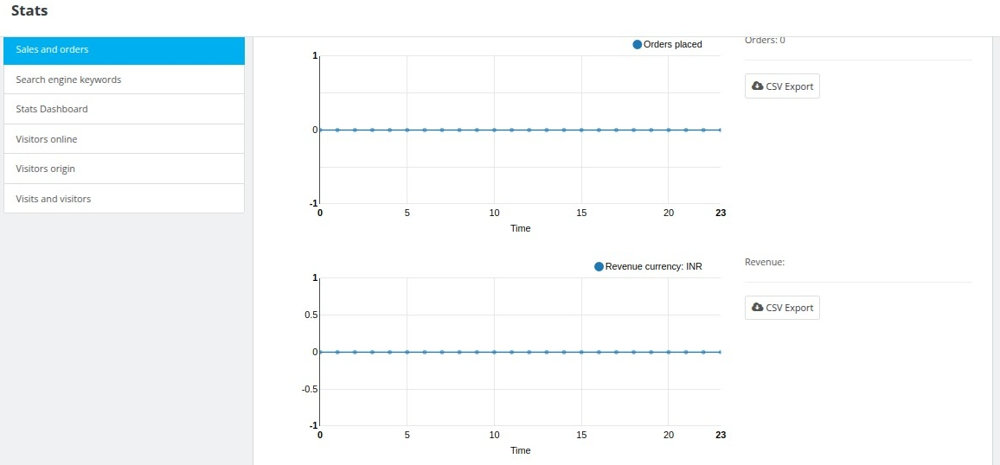

This section provides a detailed overview of order statuses and their management within your back office.  

You can modify predefined order statuses, including *Awaiting Check Payment*, *Payment Accepted*, *Processing in Progress*, *Canceled*, *Refunded*, *Payment Error*, and *Awaiting Bank Wire Payment*. Although these predefined statuses cannot be deleted, you can create new statuses to suit your specific operational needs.  

The section also includes two graphs that visually represent important trends:  
1. **Orders**: Tracks the number of orders placed over time.  
2. **Revenue**: Displays the revenue generated in your chosen currency.  

In both graphs, the Y-axis represents the respective values (number of orders or revenue), while the X-axis represents the months in the selected time range. These insights help you monitor performance and make informed business decisions.

Key features include:

- Export Options: The results can be conveniently downloaded in CSV file format for further analysis.

## Search Engine Keywords

One of the most effective ways for users to find your website is through search engines. By identifying the most popular keywords entered by your new visitors, you can determine which room types to showcase more prominently, enhancing your website's visibility in search results.

How It Works
When a visitor arrives on your website, the web server records the URL of the site they came from.
This module analyzes the URL to identify references to known search engines and extracts the keywords used.
It supports all search engines listed on the Stats and Search Engines page, and you have the option to add more search engines if needed.

## Stats Dashboard

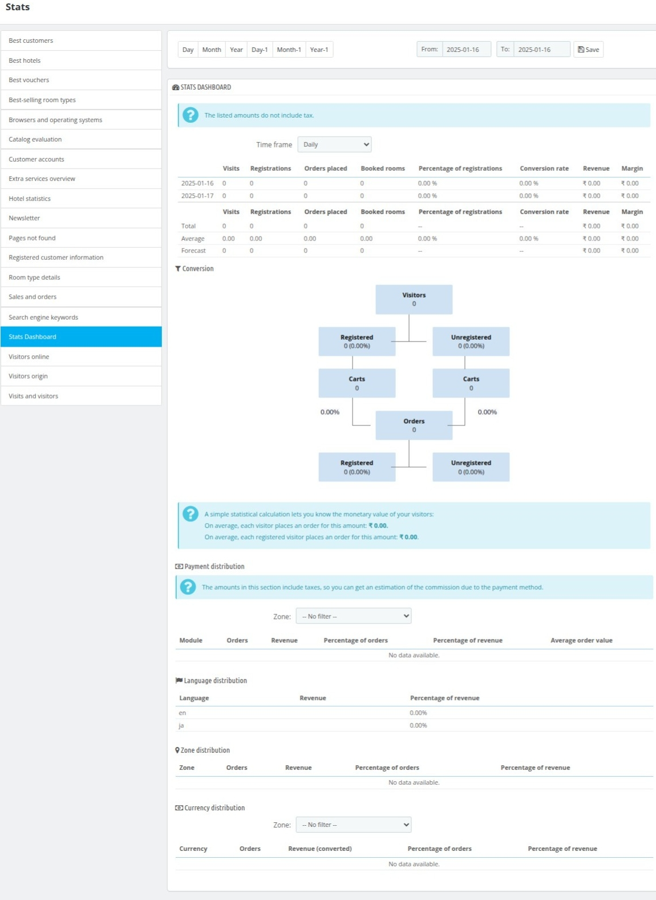

The Stats Dashboard provides an overview of your website's performance with key metrics:  
- **Timeframe Selection**: Filter stats by day, month, year, or custom date range.  
- **Metrics Table**: View data for visits, registrations, orders placed, booked rooms, conversion rate, revenue, and margin.  
- **Conversion Funnel**: Track user journeys from visitors to completed orders.  
- **Statistical Insights**: See average revenue per visitor and registered user.  
- **Payment Distribution**: Analyze orders and revenue by payment methods.  
- **Language, Zone, and Currency Distribution**: Understand performance by language, region, and currency.  

Use this dashboard to monitor trends, optimize performance, and make data-driven decisions.

## Visitors Online

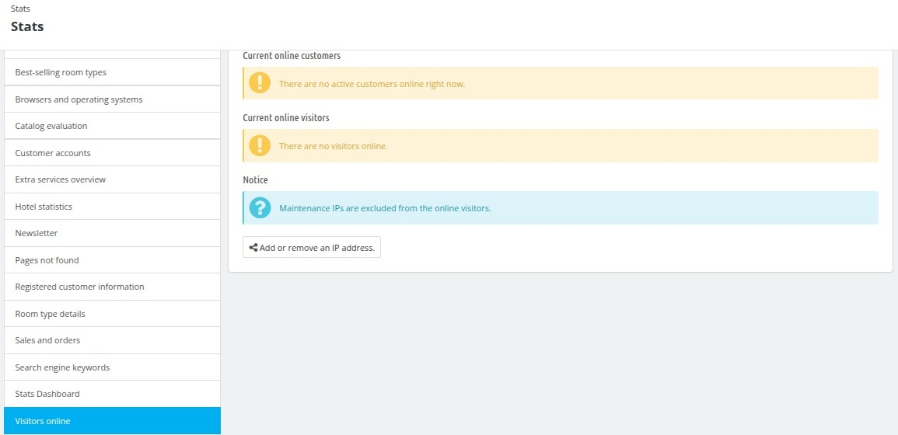

- **Online Customers**: Displays the number of active customers currently online.  
   

- **Online Visitors**: Shows the number of visitors browsing the website.  
  
- **Notice**: Maintenance IPs are excluded from the online visitor count.  

## Visitors Origin

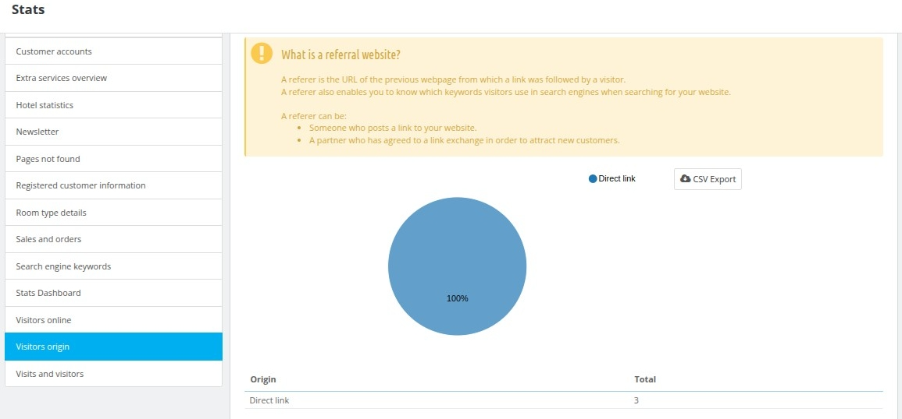

This section provides insights into how visitors are reaching your website, such as through direct links, search engines like Google, or referral websites.

Key features include:

- Export Options: The results can be conveniently downloaded in CSV file format for further analysis.

## Visits and Visitors

This section tracks website visits and visitor behavior:  
- **Graph Analysis**: View trends in visits and visitors over time.  
- **Visitor Insights**: Identify well-structured pages or potential SEO/content issues.  
- **Visit Definition**: A visit represents a single session, counted only once.  
- **Export Option**: Download data as a CSV for further analysis.  

Key features include:

- Export Options: The results can be conveniently downloaded in CSV file format for further analysis.

Use this section to monitor website performance and engagement.  

